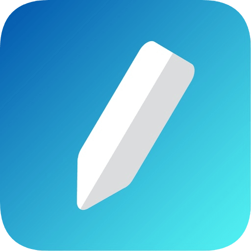
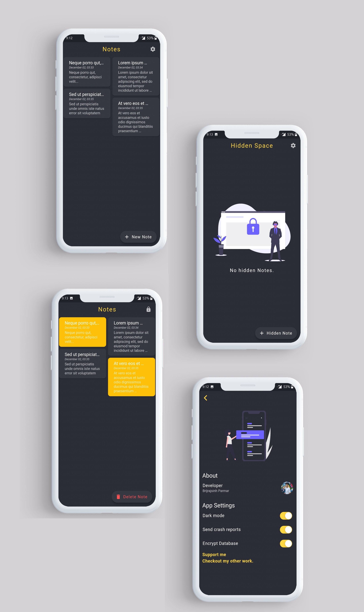
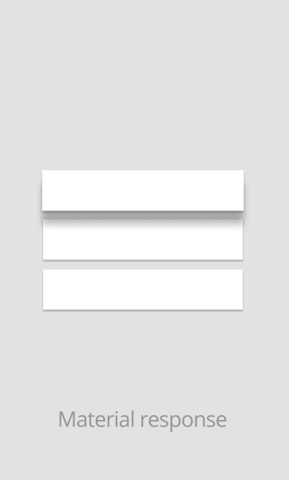
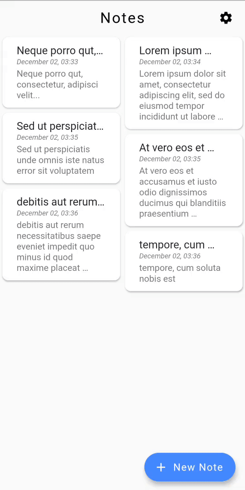
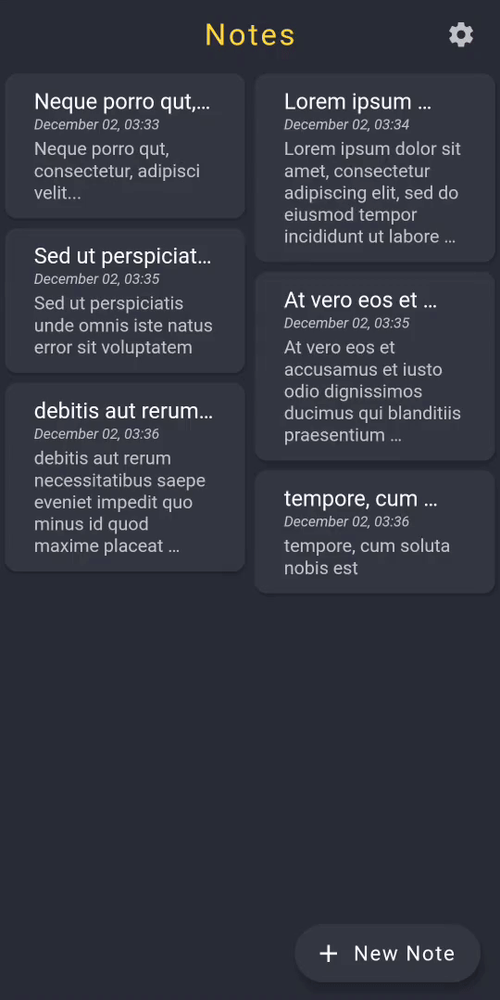
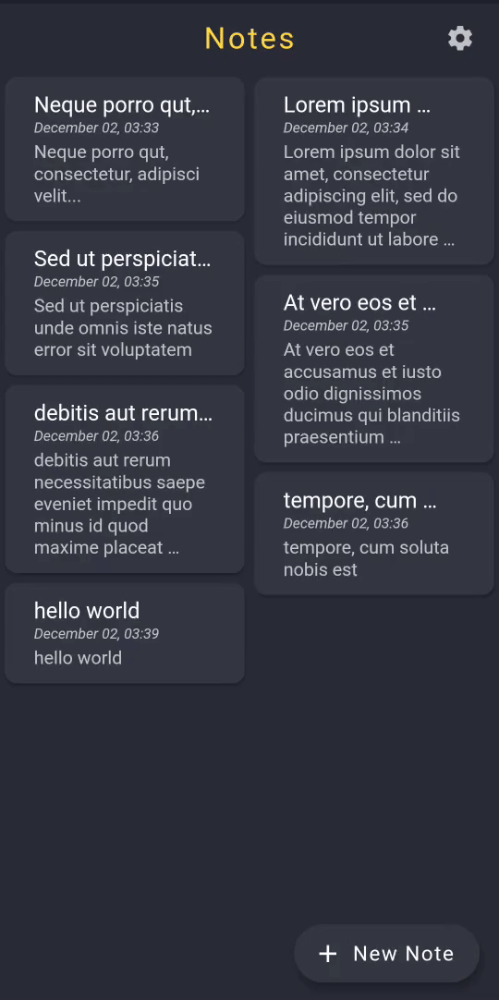
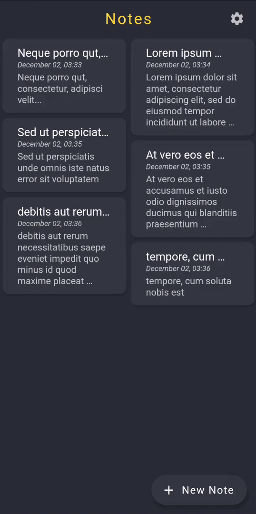

# Notekeeper

An advanced notes keeper Application made in flutter

## Features
1. *Material UI*: A beautiful, minimalist user interface with subtle animations.
2. *Dark mode*: Light and dark theme variants.
3. *Hide notes*: Mark notes as hidden and filter them.
4. *Search*: Search your notes.
5. *Edit note*: Edit note that you saved previously
6. *Share*: Share note using any app that can share text.

## Sneak peek
<table>
	<tr>
		<td style="background-color:#E2E2E2">

			

		</td>
		<td>
			
		</td>
	</tr>
	<tr>
		<td>
			
		</td>
		<td>
			
		</td>
	</tr>
	<tr>
		<td>
			
		</td>
		<td>
			
		</td>
	</tr>
</table>

## Dependencies
 - sqflite:
 - intl:
 - flutter_staggered_grid_view:
 - provider:
 - shared_preferences:
 - share:

## Download or Run the project
- With Flutter installed, clone project and run `flutter run --release` in that directory,
or
- Download the built APK from [here](https://github.com/brijrajparmar27/Flutter-Notes/raw/master/github_assets/app-release.apk)

   
Feedback is welcome! Contact me for any info.  
Made with ❤ by Brijrajsinh parmar
